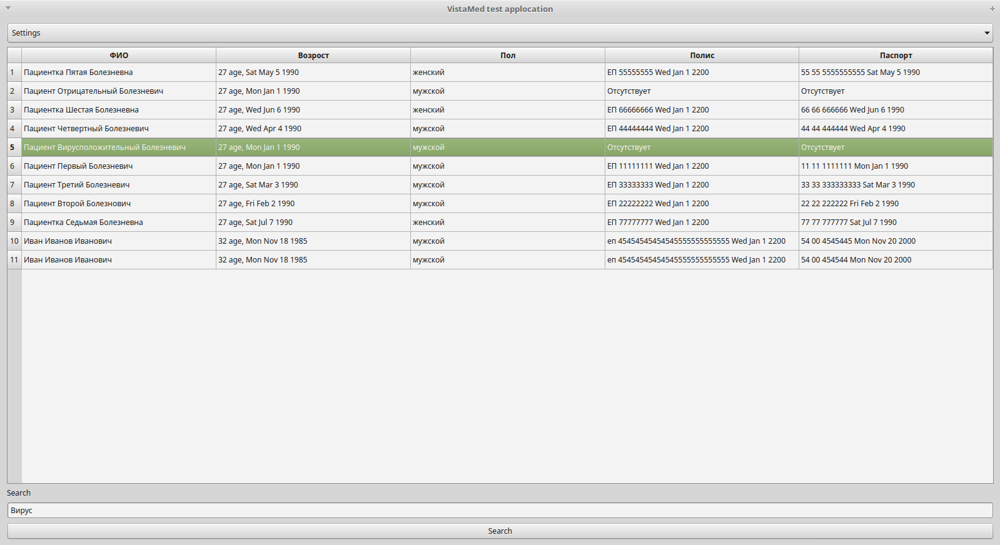

# vistamed_test
## Тестовое задание для Vistamed

Задача ваполнена в ООП стиле. Программа подключается к mysql и забирает данные по следующему запросу в класс Table, который унаследован от QTableWidget:
```select 
	C.firstName,
	C.lastName,
	C.patrName,
	C.sex,
	C.birthDate,
	CP.serial,
	CP.number,
	CP.endDate,
	CD.serial,
	CD.number,
	CD.date 

from Client C 
left join 
	ClientPolicy CP on C.id = CP.client_id 
left join 
	ClientDocument CD on CD.client_id = C.id;
```

получается таблицу вида: 


## Классы 
* класса SettingsWindow содержит поля для ввыода настроек
* Класс Table выполняет поиск в таблице по флагу QtCore.Qt.MatchContains и тексту из ViewerWidget.search_line, подсвечивает строки с вхождениями. Поиск выполняется по нажатию кнопки Search
* Класс ViewerWidget унаследованный от QtGui.QWidget отображает все графические компоненты программы и управляет их сигналами

## Кнопки
* Кнопка Reload забирает данные из полей класса SettingsWindow и передает их Table для перезагрузки таблицы
* Кнопка Quit завершает работу программы
* Кнопка Settings вызывает окно настроек, при нажатии кнопки ОК, программа актоматически делаетпопытку считать данные из БД

## Сообщения об ошибках:
* Connection data is incorrect - программа не смогла подключиться к базе данных
* Can't make correct query to mysql - программе не удалось выполнить запрос к базу данных

## Интерфейс

* Главное окно


* Окно настроек


* Таблица с установленным выделением



## Используемые средства

* Python 2.7.12 (default, Nov 19 2016, 06:48:10) 
* GCC 5.4.0 20160609 on linux2
* Linux 4.4.0-21-generic #37-Ubuntu SMP Mon Apr 18 18:33:37 UTC 2016 x86_64 x86_64 x86_64 GNU/Linux
* Spyder 2 
* PyQt4 ('Qt version:', '4.8.7')

## Результат 

Задание выполнено. 
По ходу решения вознимающих проблемм, было найдено более элегантное решение для представления БД
https://stackoverflow.com/questions/14068823/how-to-create-filters-for-qtableview-in-pyqt 
Суммарное время выполнения занело около суток. С приведенным выше решением проблемму скорее всего можно было решить за 3 часа.
Было приятно поработать.:)

